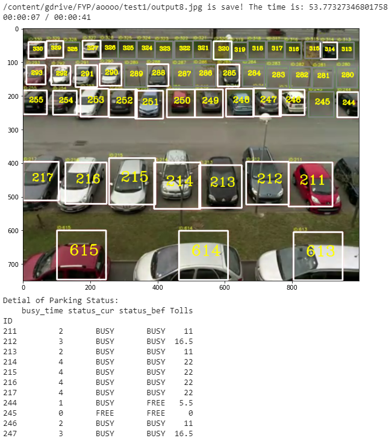

# Robust Outdoor Smart Parking Lots Detection System Under Illuminance Variance
# 在光照變化下強大的室外智能停車場檢測系統

Python implementation in binary classification of parking lot occupancy detection under the illuminance variance via smart camera. It based on Convolutional Neural Network model. The aims and expected deliverables is:
 * Development of CNN model specifically for parking lots.
 * Development of an integrated smart parking lots detection system.
 * Development of techniques in generative modeling for dealing with illuminance variance.
 * An integrated smart parking lots detection system applicable to outdoor parking lots

在照度變化下通過智能相機對停車場佔用率進行二進制分類的Python實現。 它基於卷積神經網絡模型。 目標和預期可交付成果是：
 * 開發專用於停車場的CNN模型。
 * 開發集成的智能停車場檢測系統。
 * 生成建模中用於處理照度差異的技術的發展。
 * 適用於室外停車場的集成智能停車場檢測系統

---

### Installation Requirements  ###
This project depends on the following libraries:
1. Python >= 3.0
2. Tensorflow >= 2.5.0
3. Keras >= 2.0
4. NumPy, OpenCV, pandas, etc.

---

## Overview ##

### Data ###

The original dataset is from [CNR-EXT](http://cnrpark.it/) and [PKLot](https://web.inf.ufpr.br/vri/databases/parking-lot-database/), and I've downloaded it and done the pre-processing.

You can find it in .

### Data augmentation ###

The data for training contains 30 512*512 images, which are far not enough to feed a deep learning neural network. I use a module called ImageDataGenerator in keras.preprocessing.image to do data augmentation.

See dataPrepare.ipynb and CNN_data.py for detail.

### Training  Usage ###

---

### Contact information ###
Students:
 * Chiang Weng Hou, email: wenghouchiang@gmail.com
 * Tai Chon Kit   , email: tears0147@gmail.com

Supervisor:
 * Prof. C. M. Vong
 
Assistant:
 * Milton Wong
