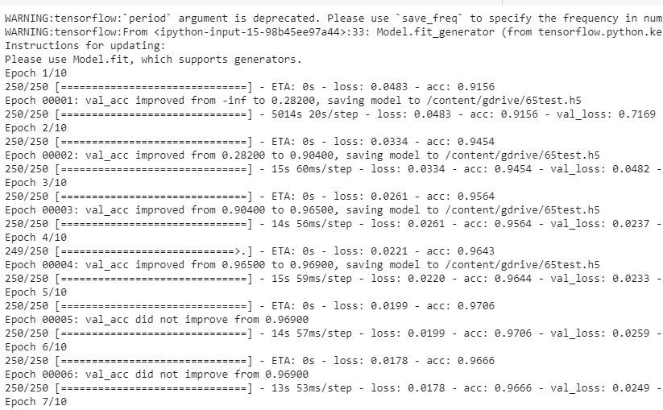
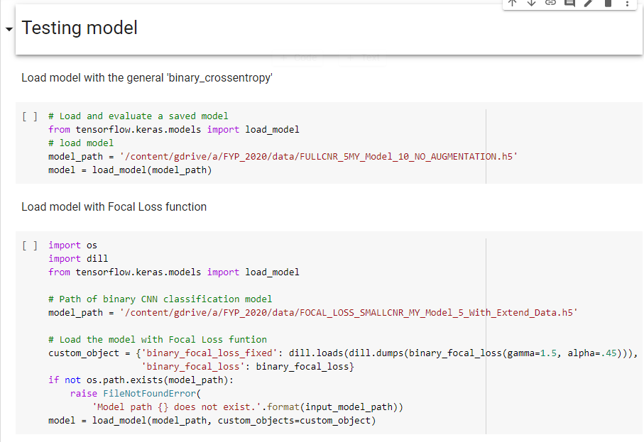
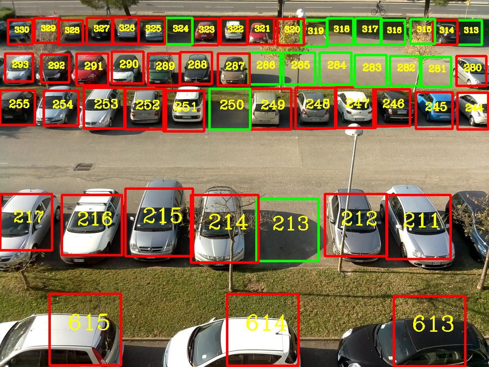
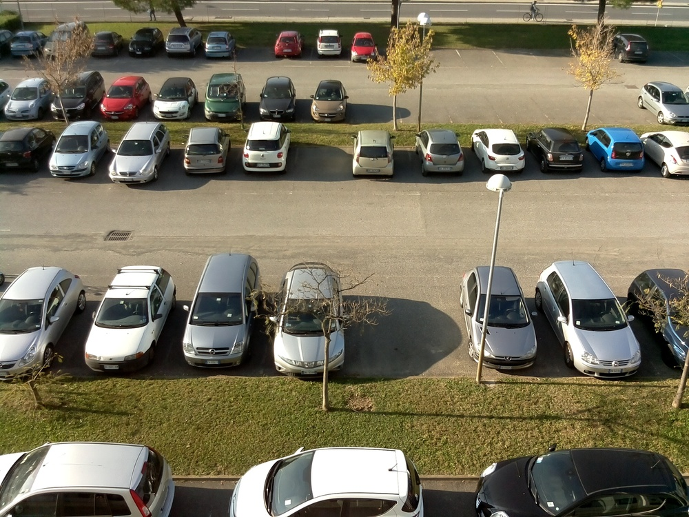

# Robust Outdoor Smart Parking Lots Detection System Under Illuminance Variance
# 在光照變化下強大的室外智能停車場檢測系統

Python implementation in binary classification of parking lot occupancy detection under the illuminance variance via smart camera. It based on Convolutional Neural Network model. The aims and expected deliverables is:
 * Development of CNN model specifically for parking lots.
 * Development of an integrated smart parking lots detection system.
 * Development of techniques in generative modeling for dealing with illuminance variance.
 * An integrated smart parking lots detection system applicable to outdoor parking lots

在照度變化下通過智能相機對停車場佔用率進行二進制分類的Python實現。 它基於卷積神經網絡模型。 目標和預期可交付成果是：
 * 開發專用於停車場的CNN模型。
 * 開發集成的智能停車場檢測系統。
 * 生成建模中用於處理照度差異的技術的發展。
 * 適用於室外停車場的集成智能停車場檢測系統

---

### Installation Requirements  ###
This project depends on the following libraries:
1. Python >= 3.0
2. Tensorflow >= 2.5.0
3. Keras >= 2.0
4. NumPy, OpenCV, pandas, etc.

---

## Overview ##

### Data ###

The original dataset is from [CNR-EXT](http://cnrpark.it/) and [PKLot](https://web.inf.ufpr.br/vri/databases/parking-lot-database/), and I've downloaded it and done the pre-processing.

You can find it in src/CNN_data.py, or https://drive.google.com/drive/folders/1RMCSkA3DoDFy4S1Rwc8Pcog2HOmrjICI?usp=sharing, or FYP_FULL_version_05_06_2020.ipynb to get the train, test, and validation dataset.

### Data augmentation ###

The data for training contains few sunshine dataset, which are far not enough to feed a deep learning convolutional neural network (CNN), due to the low performance in generalization ability. I use a module called ImageDataGenerator in keras.preprocessing.image and a common image-to-image translation technology CycleGAN to do data augmentation.

See dataPrepare.ipynb or FYP_FULL_version_05_06_2020.ipynb for detail.

### Training  Usage ###

Use the train_CNN_Model.ipynb or FYP_FULL_version_05_06_2020.ipynb to train the CNN model by the train and validation dataset. Callbacks function used to avoid overfitting problem, and Focal loss used to improve the performance after data augmentation

### Testing  Usage ###
Use the FYP_FULL_version_05_06_2020.ipynb to test the CNN model in Testing model part. First, we choose the CNN model to load by two categories. One is using focal loss, another is Python library loss function.

Then, we can load the sample image in data/parkingLot_image_sample.jpg and data/camera8.csv to get the detection result by CNN model. i.e. run # One example with binary CNN classification model

Also, we can download the video from [Google drive link](https://drive.google.com/drive/folders/19CvrTMxMLYRxb9W1pxiFs1ecgBuy3W-2?usp=sharing) or https://www.youtube.com/watch?time_continue=3&v=HnJYSWY60nA. And run the 'Sample simulation realistic working process in smart camera' part. Get the result in the first image demo/Final_result_sample.png.

### Objectives
Camera received Image             |  Camera Output Image
:-------------------------:|:-------------------------:
  |  

---

### Contact information ###
Students:
 * Jason, email: jasonobjk@gmail.com
 * Randy, email: tears0147@gmail.com

Supervisor:
 * Prof. C. M. Vong
 
Assistant:
 * Milton Wong
